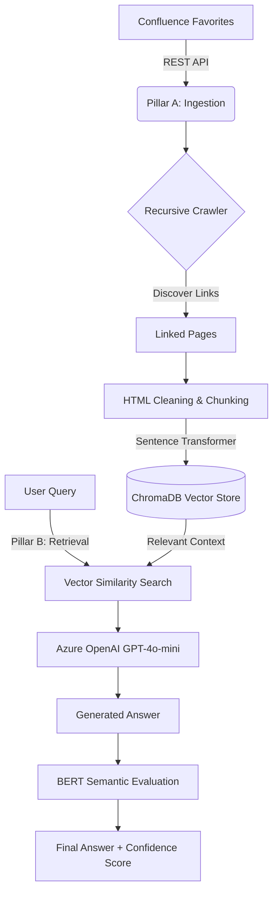

# 🧠 Yuan-Yuan's AI Knowledge Base Assistant

A Retrieval-Augmented Generation (RAG) system designed to transform curated Confluence documentation into a searchable, intelligent assistant.

## 🚀 Overview
This project was developed to centralize and democratize "tribal knowledge" within an enterprise environment. By indexing curated Confluence pages, the assistant provides accurate, cited answers to complex technical questions, such as SAS migration workflows.

## 🏛️ Architecture
The system is divided into a two-pillar architecture to separate data engineering from the user interface:
```
Data Layer
    ↓
Embedding Layer
    ↓
Vector Store
    ↓
Retrieval Layer
    ↓
Prompt Assembly
    ↓
LLM
    ↓
Evaluation Layer
```
### 🔄 System Workflow

- **Pillar A (Ingestion):** A recursive crawler that discovers Confluence pages, cleans HTML content, and generates 384-dimensional vector embeddings using a local `all-MiniLM-L6-v2` transformer.
- **Pillar B (Interface):** A RAG-based chat interface utilizing **Azure OpenAI (GPT-4o-mini)**. It includes a local **BERT-based semantic evaluator** to score the quality of AI responses.

## 🛠️ Tech Stack
- **Language:** Python
- **Vector Database:** ChromaDB
- **LLM:** Azure OpenAI
- **Embeddings/Evaluation:** Sentence-Transformers (BERT)
- **Environment:** Hosted on internal Linux Server (Gershwin)

## 📐 Data Engineering & Chunking Strategy
To ensure the LLM receives meaningful context, this project moves away from generic "fixed-length" chunking in favor of a **Context-Aware Paragraph Strategy**:

* **Chunking Method:** Semantic Paragraph Splitting.
* **Strategy:** Instead of cutting text at a rigid character limit (which often splits code blocks or tables in half), the system splits data at double-newlines (`\n\n`). 
    1. Split cleaned Confluence text into logical paragraphs. 
    2. Filter out short fragments (<50 characters). 
    3. Detect oversized paragraphs (>1500 characters).
    4. Recursively split large blocks using overlapping chunking.
    *  **Parameters:**
        - paragraph min length: 50 characters
        - max chunk size: 1500 characters
        - fallback split: 1000 characters with 100 character overlap
* **Average Chunk Size:** ~500 - 1,000 characters.
* **Overlap:** None for standard paragraph chunks. Oversized paragraphs are recursively split using 1000-character chunks with 100 character overlap to preserve continuity. By splitting at logical paragraph breaks and using high-quality metadata, we maintain the "unity" of technical instructions without the "noise" of repeated text. 
* **Why?** Technical documentation (like SAS migration steps) is often written in self-contained steps. Paragraph-based splitting ensures that a single instruction or code block is never "decapitated," providing the LLM with a complete thought every time, while preventing embedding truncation in the all-MiniLM-L6-v2 model.

## 💂‍♂️ Token Budget Management
To prevent "Context Overload" and ensure high-speed responses, the system employs a strict **Token Guardrail**:

1. **Rank:** Chunks are ranked by semantic similarity to the user query.
2. **Calculate:** Using `tiktoken`, the system calculates the exact token footprint of each candidate.
3. **Prune:** Context is assembled piece-by-piece until the ~3,000 token limit is reached.
* **Benefit:** This prevents the LLM from getting "Lost in the Middle" and keeps Azure OpenAI costs and latency optimized.

## 🛡️ Reliability & Trust (Evaluation Layer)
Unlike standard chatbots, this system includes a **Self-Correction Loop**:
* **Citations:** Every claim is tied to a `SOURCE` Confluence ID.
* **BERT Confidence:** A local transformer model compares the AI's answer to the original question. If the similarity score is low, the system flags the response with a ⚠️ Moderate/Low Confidence warning.

## 📁 Project Structure
```
Yuan_Yuan_RAG/
├── Data_Ingestion_Pipeline.ipynb   # Pillar A: Data factory & Vectorization
├── Yuan_Yuan_RAG_Interface.ipynb   # Pillar B: Chat UI & BERT Evaluation
├── rag_util.py                     # Shared utility functions (API, Cleaning, Logic)
├── .env.example                    # Template for required environment variables
└── requirements.txt                # List of Python dependencies
```

## 📝 License
This project is licensed under the MIT License - see the LICENSE file for details.
## 🤝 Contributing
Contributions are welcome! Please feel free to submit a Pull Request.<br>
📧 Contact<br>

Author: Yuan-Yuan Olsen<br>
Email: yuanyuan.a.olsen@healthpartners.com <br>
Project Link: https://github.com/yaolsenarch/Yuan_Yuan_RAG